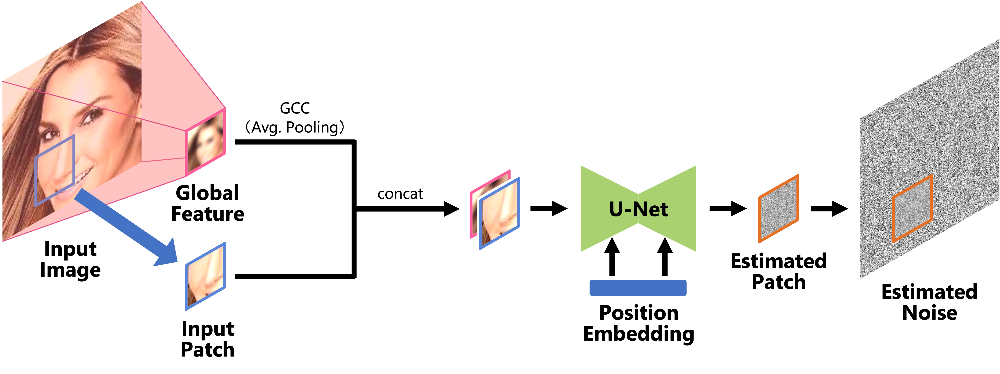

# Patch-based DDPM<br><sub>Official PyTorch implementation of the CVPRW 2023 paper</sub>



**Memory Efficient Diffusion Probabilistic Models via Patch-based Generation**<br>
[Shinei Arakawa](https://shineiarakawa.github.io/). Hideki Tsunashima. Daichi Horita. [Keitaro Tanaka](https://sites.google.com/view/keitarotanaka/). Shigeo Morishima<br>
https://generative-vision.github.io/workshop-CVPR-23/data/9.pdf<br>

Abstract: *Diffusion probabilistic models have been successful in generating high-quality and diverse images. However, traditional models, whose input and output are high-resolution images, suffer from excessive memory requirements, making them less practical for edge devices. Previous approaches for generative adversarial networks proposed a patch-based method that uses positional encoding and global content information. Nevertheless, designing a patch-based approach for diffusion probabilistic models is non-trivial. In this paper, we resent a diffusion probabilistic model that generates images on a patch-by-patch basis. We propose two conditioning methods for a patch-based generation. First, we propose position-wise conditioning using one-hot representation to ensure patches are in proper positions. Second, we propose Global Content Conditioning (GCC) to ensure patches have coherent content when concatenated together. We evaluate our model qualitatively and quantitatively on CelebA and LSUN bedroom datasets and demonstrate a moderate trade-off between maximum memory consumption and generated image quality. Specifically, when an entire image is divided into 2 x 2 patches, our proposed approach can reduce the maximum memory consumption by half while maintaining comparable image quality.*

## Setup
### Requirements
- Python 3.10 (or later)
- Pipenv

### Install dependencies
We provide `Pipfile` to setup all dependencies through `pipenv` library. Make sure `pipenv` is already installed and then run the following command to install libraries and launch a new shell in the project root directory. This might take a few minites.
```bash
pipenv install
pipenv shell
```
## Pre-trained models
We provide the following pre-trained weights. You can quickly run sampling by specify the path to your downloaded pre-trained weights.

- CelebA on 2 x 2 patch division: [here]()
- CelebA on 4 x 4 patch division: [here]()
- CelebA on 8 x 8 patch division: [here]()
- LSUN bedroom on 2 x 2 patch division: [here]()
- LSUN bedroom on 4 x 4 patch division: [here]()
- LSUN bedroom on 8 x 8 patch division: [here]()

## Getting Started
### Sampling


### Training


### Evaluation


## Citation
```
@misc{arakawa2023memory,
      title={Memory Efficient Diffusion Probabilistic Models via Patch-based Generation}, 
      author={Shinei Arakawa and Hideki Tsunashima and Daichi Horita and Keitaro Tanaka and Shigeo Morishima},
      year={2023},
      eprint={2304.07087},
      archivePrefix={arXiv},
      primaryClass={cs.CV}
}
```

## Acknowledgements
We thank Asst. Prof. Qi Feng for valuable feedbacks as well as English proofreading and Yoshiki Kubotani for feedbacks regarding the graphical design.
This research is supported by the JSPS KAKENHI Grant Number 21H05054.
This implementation is heavily based on the repo [denoising-diffusion-pytorch](https://github.com/lucidrains/denoising-diffusion-pytorch).
